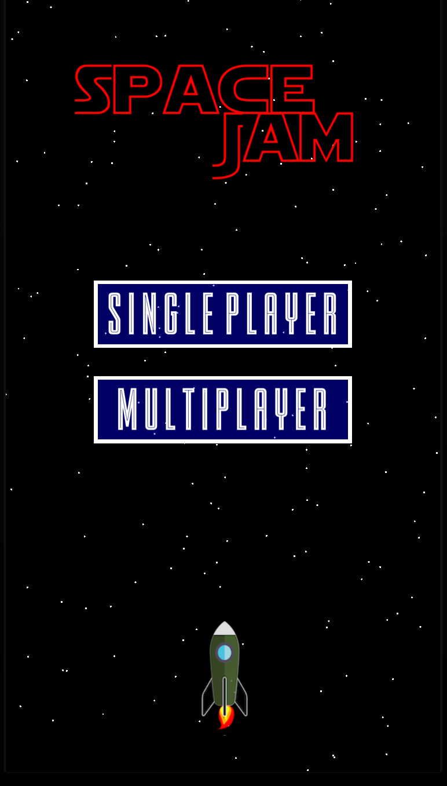
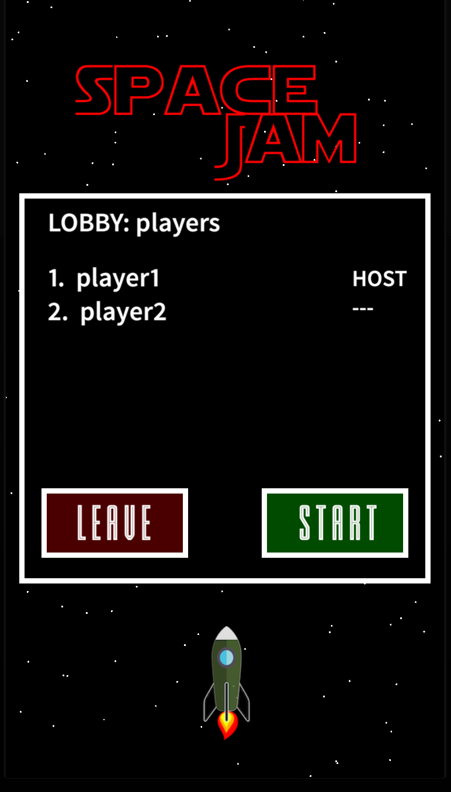
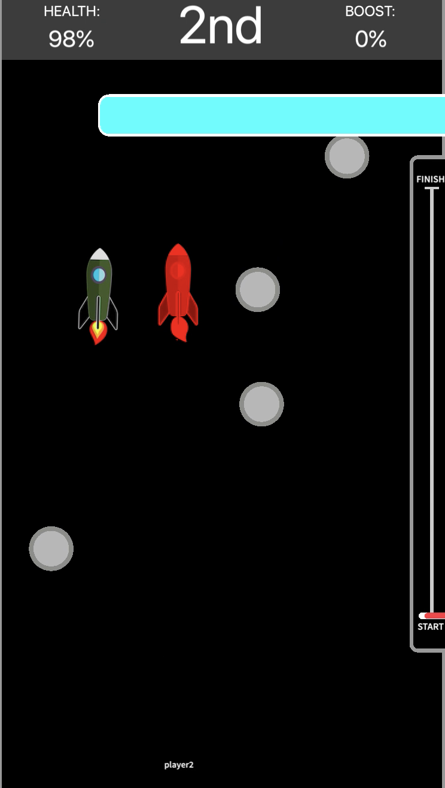

# Mobile Multiplayer Networked game optimised for unreliable connections

The project was developed as the Final Year BSc Computer Science dissertation.

Project submitted the 25th of May 2020 at the University of Reading

**Final Grade: First Class Honours**

The repository contains two Applications:
- Client: Client Mobile Application written in Lua
- Server: Server Backend Application written in Javascript (NodeJS framework) with local mysqlite3 database.

<table>
  <tr>
    <td valign="center" width=30%></td>
    <td valign="center" width=30%></td>
    <td valign="center" width=30%></td>
  </tr>
 </table>
 
